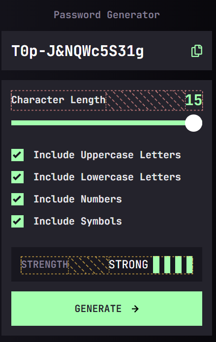
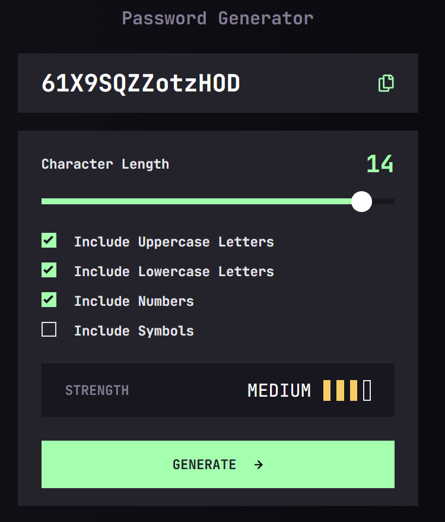

# 📌 Password Generator App

## 📝 Descripción
Reto de **Frontend Mentor**: generador de contraseñas responsive. Permite elegir la **longitud**, activar **mayúsculas, minúsculas, números y símbolos**, muestra un **indicador de fortaleza** y copia la contraseña al portapapeles. Construido con utilidades personalizadas de Tailwind y JavaScript Vanilla.

---

## 📸 Capturas de pantalla

### 📱 Vista Mobile

### 💻 Vista Desktop

---

## 🛠 Tecnologías utilizadas
- HTML5  
- CSS3  
- Tailwind CSS (utilidades `@utility`, tema con `@theme`)  
- JavaScript (Vanilla)  
- Google Fonts (JetBrains Mono)

---

## 🚀 Retos
- Personalizar el **input range** (track y thumb) con CSS puro y mantener la barra con **gradiente dinámico** según el valor del slider.  
- Diseñar una **métrica de fortaleza** combinando longitud (70%) y tipos de caracteres (30%), y reflejarlo en las barras de estado.  
- Manejar correctamente `:checked` en una **lista de checkboxes** y sincronizar el UI sincrónicamente con eventos `input/change`.  
- Estructurar **rangos ASCII** para generar caracteres aleatorios sin librerías externas y asegurar que el resultado sea visible y copiable.

---

## 📚 Aprendizajes
- Uso práctico de `document.querySelectorAll(".checkbox:checked").length` para contar opciones activas en tiempo real.  
- Cómo actualizar estilos **inline** (gradiente del slider) desde JS para feedback inmediato.  
- Patrón de **mapas de configuración** (rangos por tipo de carácter) y funciones utilitarias para selección aleatoria.  
- Creación de utilidades de Tailwind con `@utility` y **tokens de tema** con `@theme` para tipografías, colores y spacing coherentes.  
- Implementación de la **Clipboard API** con mensajes de confirmación accesibles.

---

## 👨‍💻 Autor
**Jesus Anguiano**
